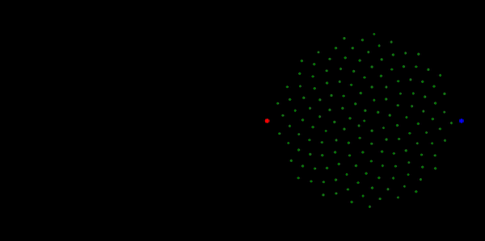

# Hawk-and-Dove-1.0
This code simulates the Hawk-Dove Game, a renowned model in evolutionary game theory, visually. Some modifications to the original model have been made to enhance the realism of this simulation. The user has the ability to set the parameters of the game.

## My Rules(This is a lot so feel free to not read this): 
1. Each day, a limited supply of food is available.
2. Hawks and Doves will search for food once per day.
3. They will choose food randomly.
4. If multiple Doves select the same piece of food, they will divide it evenly among themselves.
5. If multiple Hawks select the same piece of food, they will fight over it and eventually split it evenly, but will lose a set portion of the food as a penalty for fighting.
6. If Hawks and Doves both select the same piece of food, the Hawks will take the majority of it, while the Doves will divide their portion evenly among themselves. If there are multiple Hawks, they will fight over their portion and eventually split it evenly, but will lose a set portion of the food as a penalty for fighting.
7. If a Hawk or Dove selects a piece of food and no one else chooses it, they will get the entire piece.
8. At the end of the day, any Hawk or Dove without the minimum required amount of food will die.
9. At the end of the day, any Hawk or Dove with more food than they need to survive will reproduce, creating new Hawks or Doves equal to (excess food - food needed to survive) / food needed to survive.
7. The food supply is reset every day.
### Rules Basically: 
Doves are nice and Hawks are jerks that fight.
